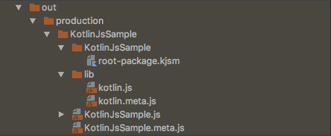
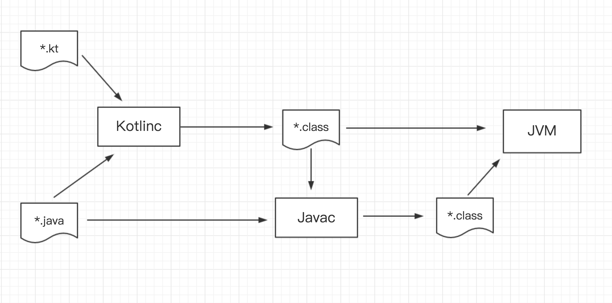
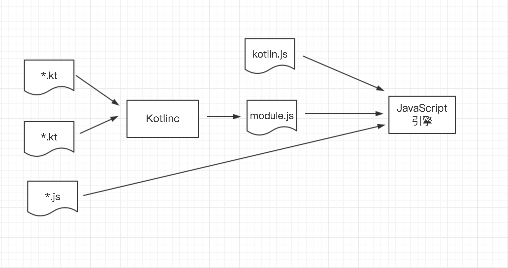

# Kotlin新特性之JavaScript支持
Kotlin1.1版本正式加入了对JavaScript的支持，也就是说我们可以Kotlin进行网页开发，并且Kotlin也支持了与JavaScript的相互操作。众所周知，JavaScript是动态类型的语言，而相对来说，Kotlin和Java都是静态类型的。同时，两者在编译运行也很不一样，Java更偏向与编译型语言，而JavaScript更偏向于解释型语言。所以，在Kotlin完美兼容Java的同时，增加了JavaScript的支持，让人好奇不已。接下来，我们就来谈谈Kotlin是如何支持JavaScript，以及它是怎么实现的。

## Kotlin转JavaScript
我们先通过一个简单的例子说明Kotlin如何支持JavaScript。
定义以下Kotlin代码：

```java
//Main.kt
fun main(args: Arrays<String>) {
  println("Hello JavaScript")
}
```

然后Kotlin编译器进行编译，会生成以下输出结果：



从图中可以看出，当Kotlin编译器进行编译转换成了JavaScript，主要输出了两个文件:

- kotlin.js: Kotlin支持JavaScript运行时的标准库。它在应用程序之间都是一样的，可想而知，这是为了让Kotlin支持JavaScript而做的封装库。
- KotlinJsSample.js： Kotlin代码转成JavaScript的等价代码。KotlinJsSample是模块名，也就是说在同一个模块下的所有Kotlin文件都会被编译在同一个JavaScript文件下，以模块名称为名。

接下来，我们来看看上述Kotlin代码转成JavaScript的等价代码，即KotlinJaSample.js。

```java
if (typeof kotlin === 'undefined') {
  throw new Error("Error loading module 'KotlinJsSample'. Its dependency 'kotlin' was not found. Please, check whether 'kotlin' is loaded prior to 'KotlinJsSample'.");
}
var KotlinJsSample = function (_, Kotlin) {
  'use strict';
  var println = Kotlin.kotlin.io.println_s8jyv4$;
  function main(args) {
    println('Hello JavaScript');
  }
  _.main_kand9s$ = main;
  Kotlin.defineModule('KotlinJsSample', _);
  main([]);
  return _;
}(typeof KotlinJsSample === 'undefined' ? {} : KotlinJsSample, kotlin);
```

首先，我们可以看到，运行该代码的前提是依赖引入`kotlin.js`标准库，并且在HTML内部加载该JS代码时，必须优先加载`kotlin.js`运行时标准库，然后再加载我们的应用程序代码JS。

也就是下面这样子的，

```html
<!DOCTYPE html>
<html lang="en">
<head>
    <meta charset="UTF-8">
    <title>Kotlin JavaScript Sample</title>
</head>
<body>
<!-- 优先加载kotlin.js，再加载应用程序代码KotlinJsSample.js-->
<script type="text/javascript" src="out/production/KotlinJsSample/lib/kotlin.js"></script>
<script type="text/javascript" src="out/production/KotlinJsSample/KotlinJsSample.js"></script>

</body>
</html>
```

回到`KotlinJsSample.js`代码，我们可以看到，它声明了一个KotlinJsSample的函数，同样的也与模块名一致。接下来，它定义了与Kotlin中对应的main函数，并进行了`println`的输出操作。

那么，`kotlin.js`在这其中充当了什么作用呢？我们来看一下。


```js
//KotlinJsSample.js
var println = Kotlin.kotlin.io.println_s8jyv4
```

然后调用`kotlin.js`中的`println_s8jyv4`函数。

```js
//kotlin.js
package$io.println_s8jyv4$ = println_0;
...

function println_0(message) {
  output.println_s8jyv4$(message);
}
...

BaseOutput.prototype.println_s8jyv4$ = function(message) {
  //打印字符串
  this.print_s8jyv4$(message);
  //打印换行符
  this.println();
};
...

```

我们可以看到，对于Kotlin中的`println`函数，js中进行了两步操作，输出字符串和换行符。先来看，如果输出字符串。

```js
BufferedOutputToConsoleLog.prototype.print_s8jyv4$ = function(message) {
  var s = String(message);
  var i = lastIndexOf_0(s, 10);
  if (i >= 0) {
    this.buffer = this.buffer + s.substring(0, i);
    this.flush();
    s = s.substring(i + 1 | 0);
  }
  this.buffer = this.buffer + s;
};
//console.log输出
BufferedOutputToConsoleLog.prototype.flush = function() {
  console.log(this.buffer);
  this.buffer = "";
};

```
在`kotlin.js`中对目标字符串进行了处理，以`buffer`的形式通过js的`console.log()`进行了输出。

接下来，进行换行操作符的输出。`this.println()`

```js
//打印换行符
BaseOutput.prototype.println = function() {
  this.print_s8jyv4$("\n");
};

```
输出换行符`\n`，输出过程和上述一致。

通过以上的分析，我们知道了从Kotlin的`println`等价到JavaScript的功能，Kotlin的标准库`kotlin.js`充当了一个中间人的角色，封装了大量函数方法，这些函数与Kotlin语法更为接近。一方面让Kotlin编译器将Kotlin代码转成JavaScript时，工作量更少，只需与`kotlin.js`中进行对应；另一方面，减少产生重复多余的代码，`kotlin.js`标准库封装了大量公共方法，让转换后的代码更加简洁可读。

## Kotlin与JavaScript互操作
在谈Kotlin和JavaScript互操作之前，先吐槽一句，跟Java互操作相比，真心不方便，并且局限性挺大的。原因在于，Kotlin-Java模式中它将Java类视为Kotlin类，并且Java类也将Kotlin类进行Java类，所以在两者进行互操作的时候，是基本不要额外的改变的。然而，我们知道JavaScript是一种动态类型语言，而Kotlin是静态类型语言，可以说它们两者是区别挺大的，也就不能跟Java一样，自由的进行互操作。

### Kotlin中调用JavaScript
在Kotlin代码中，如果想要调用JavaScript代码，基本上有两种方式：`js()`内联模式和头文件模式。

#### js()内联JavaScript
我们可以使用`js("...")`函数将一些JavaScript代码直接嵌入到Kotlin代码中。但是，有一点要求，js函数的参数必须是字符串常量。

举个例子：

```java
//Main.kt
fun main(args: Array<String>) {
    val message = "Hello JavaScript"
    js("console.log(message)")

}
```

编译转换成JavaScript代码，

```js
if (typeof kotlin === 'undefined') {
  throw new Error("Error loading module 'KotlinJsSample'. Its dependency 'kotlin' was not found. Please, check whether 'kotlin' is loaded prior to 'KotlinJsSample'.");
}
var KotlinJsSample = function (_, Kotlin) {
  'use strict';
  function main(args) {
    var message = 'Hello JavaScript';
    console.log(message);
  }
  _.main_kand9s$ = main;
  Kotlin.defineModule('KotlinJsSample', _);
  main([]);
  return _;
}(typeof KotlinJsSample === 'undefined' ? {} : KotlinJsSample, kotlin);

```

我们可以看到，对于js()函数里的参数，Kotlin编译器选择了不处理，直接输出。所以，这也就说明了为什么js()函数为什么必须是要常量的原因了。

不信？我们可以试试。

```java
fun main(args: Array<String>) {
    val message = "Hello JavaScript"
    val console = "console."
    js(console + "log(message)")

}
```

编译转换成JavaScript代码，

```js
...

function main(args) {
  var message = 'Hello JavaScript';
  var console = 'console.';
  console.log(message);
}

...
```

运行结果：

```java
KotlinJsSample.js:9 Uncaught TypeError: console.log is not a function
    at main (KotlinJsSample.js:9)
    at KotlinJsSample.js:13
    at KotlinJsSample.js:15
```

可以看到，若参数不是字符串常量，比如以上例子，Kotlin编译器会对`console`进行处理，默认`console`是一个用户自定义的变量，那么再执行`console.log()`就会报错找不到该函数了。

#### external修饰符定义头文件
如果你用过内联JavaScript的方式，你就会知道，真的很鸡肋！做点log的工作，还能干嘛？？？

所以，Kotlin又搞了一个强大一些的方式，通过`external`修饰符定义JavaScript文件头的方式进行引入调用。

大概就是下面这样子的，

```java
//Mian.kt
external fun hello(message: String)

fun main(args: Array<String>) {
    val message = "Hello JavaScript"
    hello(message)

}
```

```js
//hello.js
function hello(message) {
    console.log(message)
}
```

这种方式下，当你在Kotlin中要使用JavaScript代码之前，必须加上相关的JavaScript头文件声明。这么做的目的，就是为了让Kotlin知道相关JavaScript函数的存在，以保证可以正常的调用到，然后在Kotlin编译器环节，直接使用到JavaScript代码。看上去挺麻烦的，但是总的来说，比内联来的强大。

### JavaScript中调用Kotlin
我们知道，Kotlin编译器会将原生的Kotlin代码转换成相应的JavaScript代码，并且对于原先Kotlin中定义的函数名和变量都不会改变，这意味着在JavaScript中我们可以自由的使用相关的函数和属性。

说白了，我们就是在JavaScript代码中调用经过Kotlin编译器转换后的JavaScript代码。

所以，能够自由调用是显而易见的，唯一的问题出在`Kotlin编译器转换`的这个过程。

为什么这么说呢？

JavaScript中有以下几种数据类型：

- number
- boolean
- string
- object
- array
- undefined
- null

而Kotlin中，有以下类型：

- Int
- Byte
- Short
- Long
- Double
- Float
- Boolean
- Char
- String
- Any
- Array
- List
- Set
- Map
- ...

显然，Kotlin拥有更复杂的数据类型。Kotlin编译器如何将Kotlin类型映射到JavaScript类型呢？如下：

- Kotlin中Int/Byte/Short/Float/Double 映射JavaScript的number
- Kotlin中String映射JavaScript中string
- Kotlin中Any映射Javas中Object
- Kotlin中Array映射JavaScript中Array
- Kotlin中Long不映射JavaScript中任何类型
- Kotlin集合（List/Set/Map等）不映射JavaScript中类型类型

看到问题了没有，由于JavaScript中没有64位整数，导致Kotlin中的Long类型没有映射到任何JavaScript对象，同理，Kotlin中的集合也没有映射到JavaScript任何特定的类型。Kotlin为了不对语言做任何的改变，仅仅是将Long和集合当成了一个模拟。

那么，如此一来，转换出了问题，在JavaScript中使用必然也会导致问题。举个例子：

```java
//Hello.kt
class Hello {
    //定义输入返回均为Long类型的函数
    fun longTest(a: Long, b: Long): Long {
        return a + b
    }
}
```

经过Kotlin编译转换成JavaScript，如下：

```js
//KotlinJsSample.js
Hello.prototype.longTest_3pjtqy$ = function (a, b) {
    return a.add(b);
  };
```

然后我们尝试在JavaScript中调用该函数,

```js
//A.js
var t = new KotlinJsSample.Hello()
console.log(t.longTest(1, 2))
```

运行，理想状态下，输出结果3。然而，报错了。。。

```java
Hello.kt:8 Uncaught TypeError: a.add is not a function
    at Hello.longTest (Hello.kt:8)
    at A.js:5
```

因为`a`为Long类型，而JavaScript无法对应，在Kotlin编译器转换的过程中无法正确映射到JS中，导致JS中找不到该函数。

**那么，不惊大呼一声，Kotlin.Long要它有何用？！！**

我们试试在Kotlin中调用它，

```java
fun main(args: Array<String>) {
    Hello().longTest(1L, 2L)
}
```

等价到JavaScript中，如下：

```js
function main(args) {
    (new Hello()).longTest(Kotlin.Long.ONE, Kotlin.Long.fromInt(2));
  }
```

好吧，当成了Int类型来处理。 = =

总的来说，基本上Kotlin和JavaScript是能够互操作的，但是对比Kotlin-Java，略显麻烦&鸡肋。

## Kotlin-Java VS Kotlin-JavaScript

最后，我们来对比一下Kotlin-Java和Kotlin-JavaScript各自做了什么工作。

### Kotlin-Java



我们可以看到，Kotlin-Java模式中，Kotlinc（编译器）将`*.kt`文件编译成了`*.class`字节码文件，同时`*.java`文件可通过Kotlinc或者Javac编译成`*.class`字节码文件，然后通过JVM虚拟机执行。

### Kotlin-JavaScript



然而，Kotlin-JavaScript模式中，Kotlinc(编译器)只是进行了转换JS的操作，然后与标准库`kotlin.js`、项目中JS文件一起再通过`JavaScript引擎`执行。

通过两者的比较，我们可以很明显看出两者在工作原理上很不一样。Kotlin对于JavaScript的支持，更多的只是将Kotlin等价转换成JavaScript以达到支持的功能，然后做一些函数的封装工作。kotlinc-js编译器做的工作大致是：词法分析、语法分析、语义分析、转成JS代码，然后通过JavaScript引擎执行。

## 总结

Kotlin能够同时支持Java和JavaScript，听上去是很让人感到兴奋的。但是就目前来说，Kotlin对于JavaScript的支持很明显的不如Java，局限性和互操作上都相差甚多。对于反射等功能，目前也尚不支持。

当然，我们仍然可以试一试~ ：D

相关资料：

官方文档：[https://kotlinlang.org/docs/reference/js-overview.html](https://kotlinlang.org/docs/reference/js-overview.html)
